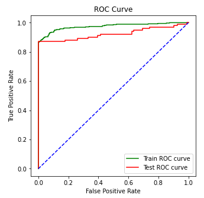

# Phase 3 Project - Syriatel Customer Churn
**Flatiron**, Module 3, Data Science Project

**Prepared by:** Stamatios Choremis

***"Without data, you are just another person with an opinion."** ***- W. Edwards Deming'***


## Table of Contents
* [Summary](#summary)
* [Data Exploration & Preparation](#data-exploration-and-preparation)
* [Data Visualizations and Exploratory Data Analysis (EDA)](#visualizations)
* [Modeling Technique, Data Models & Models Evaluation](#modeling)
* [Conclusion and Recommendations](#conclusion-and-recommendations)
* [Repository Structure](#repository-structure)


## Summary
The project is analyzing **historic data** of Syriatel **one of the only two mobile network providers in Syria** in order to predict whether a customer will ("soon") stop doing business with SyriaTel. 

In addition, the project will study the **predictable patterns** and **provide recommendations** to SyriaTel management for customer churn reduction.    

    
According to our analysis, the **most important factors** that drive the decision of a Syriatel Mobile customer to churn are the below:

- **International Plan**: 42% of the customers that have international plan churned
- **Total charges**: : Customers with high charges are more likely to churn
- **Customer Service Calls**: Customers that call the customer service line frequently (especially 4 times and more), have higher probabilities to churn

According to the above conclusions, we offer the below **recommendations**:
- 1: Syriatel should introduce a **new program for customers with high usage**. This new program can include **unlimeted calls for a monthly fee, similar to the competition.**
- 2: Syriatel should introducce a **new international plan that is more competitive**. Should analyse the prices that the competition offer for International plans and provide a similar plan
- 3: Syriatel should pay attention to the number of customer service calls that each customer makes. **Customers that call frequently the customer service line should be offered promotions or other programs to keep them with Syriatel**


## Data
* This project uses data provided by **kaggle**, with title ***Churn in Telecom's dataset**** 
* The data are available at the below link: [kaggle](https://www.kaggle.com/datasets/becksddf/churn-in-telecoms-dataset).
* The data have 21 Columns for 3333 different customers of Syriatel.

## Methodology
Our Jupyter Notebook is using the following methodology to draw a conclusion:
 - Data Preparation: Data Exploration & Preparation
 - Visualizations: Data Visualizations and Exploratory Data Analysis (EDA)
 - Modeling: Modeling Technique, Data Models & Models Evaluation
 - Conclusion & Recommendations: Best Performing Model, Conclusion & Recommendations

## Data Exploration and Preparation
***Data Exploration & Preparation***

### Data Exploration
 - About 3333 different Syriatel customers
 - 20 Columns with 17 different variables that affect customer Churn
 - The current average churn rate is 14.5% (483 customers churned out of the 3333)

### Data Preparation
 - Rename Column names
 - Review and update Data Types
 - Review Missing Data
 - Calculated and added essential columns


## Visualizations
***Data Visualizations and Exploratory Data Analysis (EDA)***

**Top variables that cause churn:**
 1. Enabled International Plan
 2. Total charges
 3. Times called the Customer Service Line
 4. Total minutes
 5. Customer Satisfaction


**Enabled International Plan is the most important factor that drive customer churn**


**Customers that call customer service frequently are more likely to churn**


**Customers with high charges are more likely to churn**


## Modeling
***Modeling Technique, Data Models and Models Evaluation***

**Modeling Technique**
 - Set Dependent and Indepentent Variables: Spliting the factors (X) from the target (y)
 - Split of data to train and test: Creating a training and testing set
 - Split of data between categorical and continuous
 - Build a Machine Learning Pipeline: Using standard scaler and one hot encoder to convert all values at the same scale
 - Combine the Standard Scaled and One Hot Encoded columns: Using ColumnTransformer


**Models Built:**
 - Model 0: Dummy Classifier
 - Model 1: Logistic Regression
 - Model 2: K-Nearest Neighbors without SMOTE
 - Model 2: K-Nearest Neighbors with SMOTENC
 - Model 3: Decision Tree without SMOTE
 - Model 4: Random Forest with SMOTE
 - Model 5: Gradient Boosting with SMOTE
 - Model 6: AdaBoost without SMOTE
 - Model 7: XGBoost without SMOTE


**Models Evaluation:**
**Gradient Boost with SMOTE** and **XGBoost** are the best performing models that generate same results. 
* The accuracy of both models is 98.1% which means that we can trust the results. 
* The Precision rate of both models is 100% and the F1-Score 93.1%. 
* Most importantly, the Racall is 87.1% which means that **our models can accuretly predict 87.1% of the times which customer is going to churn**

**Gradient Boost with SMOTE Performance**




**XGBoost without SMOTE Performance**


## Conclusion and Recommendations
**Conclusion**
According to our analysis, the most important factors that **drive the decision** of a Syriatel Mobile customer **to churn** are the below:
* `International Plan:` 42% of the customers that have international plan churned  
* `Total charges: `: Customers with high charges are more likely to churn
* `Customer Service Calls:` Customers that call the customer service line frequently (especially 4 times and more), have higher probabilities to churn

**Recommendations**
According to the above conclusions, we offer the below **recommendations**:
* `1:` Syriatel should introduce a **new program for customers with high usage**. This new program can include **unlimeted calls for a monthly fee, similar to the competition.**
* `2:` Syriatel should introducce a **new international plan that is more competitive**. Should analyse the prices that the competition offer for International plans and provide a similar plan
* `3:` Syriatel should pay attention to the number of customer service calls that each customer makes. **Customers that call frequently the customer service line should be offered promotions or other programs to keep them with Syriatel**


## Documents Attached
- The Jupyter Notebook for the Data Preparation is s available at [Data Preparation](./Data_Preparation.ipynb)
- The Jupyter Notebook for the Visualizations is s available at [Visualizations](./Visualizations.ipynb)
- The Jupyter Notebook for the Modeling is s available at [Modeling](./Modeling.ipynb)
- The presentation prepared is also available at [Presentation](./Presentation.pdf)

## Contact Details of the Author
    For any further information or questions about this report please contact Stam Choremis at schoremis@gmail.com

## Repository Structure

```
├── .ipynb_checkpoints        <- Checkpoints of the Jupyter Notebook
├── Images                    <- Visualizations created or used at the repository
├── Original_Data             <- Original Data provided and used for the analysis of the Jupyter Notebook
├── Export_Data               <- Data files exported at the Jupyter Notebook
├── Import_Data               <- Data files imported at the Jupyter Notebook
├── 1-Data_Preparation.ipynb  <- Data Exploration & Preparation
├── 2-Visualizations.ipynb    <- Data Visualizations and Exploratory Data Analysis (EDA)
├── 3-Modeling.ipynb          <- Modeling Technique, Models & Model Evaluation
├── Presentation.pdf          <- PowerPoint presentation
└── README.md                 <- The specific document that provides an overview of the report
```
